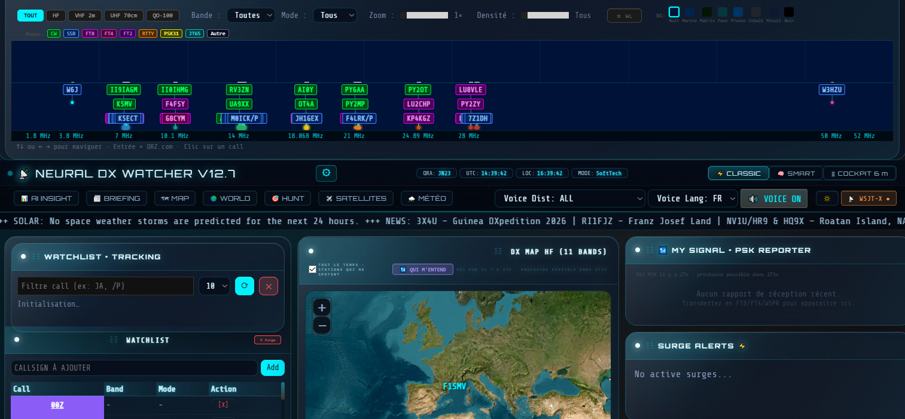

# 🛰️ Neural DX Watcher

> Real-time DX monitoring platform for amateur radio operators — F1SMV / JN23
> Raspberry Pi 5 · Flask · SQLite · Leaflet.js · WSJT-X · Adaptive AI Insight Engine

---

## 📸 Preview



---

## Table of Contents

- [Overview](#-overview)
- [Tech Stack](#-tech-stack)
- [Version History](#-version-history)
  - [v13.0 — Adaptive Insight Engine ← CURRENT](#v130--adaptive-insight-engine--current)
  - [v12.7 — Fixes & Polish](#v127--fixes--polish)
  - [v12.6 — VOACAP HF Propagation](#v126--voacap-hf-propagation)
  - [v12.5 — AI Insight Engine (birth)](#v125--ai-insight-engine-birth)
  - [v12.2 — MSK144 & Satellites](#v122--msk144--satellites)
  - [v12.1 — Beacons & Lightning](#v121--beacons--lightning)
  - [v11.x — Data & Infrastructure](#v11x--data--infrastructure)
  - [v9.5 — Foundations & Roadmap](#v95--foundations--roadmap)
- [AI Insight Page — Detailed Architecture](#-ai-insight-page--detailed-architecture)
- [Deployment](#-deployment)
- [Available APIs](#-available-apis)

---

## 🎯 Overview

Neural DX Watcher is a personal DX monitoring web application for amateur radio operators. It aggregates in real time DX cluster telnet spots, local WSJT-X UDP decodes, solar propagation data (SFI/K/A), space weather, VHF/UHF beacons, SGP4 satellite tracking, and weather/lightning correlations.

Since v12.5, the app embeds an **adaptive AI engine** that predicts propagation openings, measures its own errors, and self-optimizes every night — an experimental ambition for a solo Pi project.

---

## 🔧 Tech Stack

| Component | Technology |
|-----------|------------|
| Backend | Python 3.11 / Flask |
| Database | SQLite (`analytics.sqlite`, `predictor.sqlite`) |
| Frontend | Leaflet.js, SortableJS, Space Grotesk / IBM Plex Mono |
| Solar data | NOAA SWPC (SFI, K, A) |
| HF Propagation | VOACAP (integrated v12.6) |
| Weather / Tropo | Open-Meteo (850hPa, humidity, CAPE) |
| Lightning | Blitzortung MQTT (3×3 grid around QTH) |
| Reception reports | PSK Reporter MQTT + HTTP fallback |
| WSPR | wspr.live |
| Satellites | CelesTrak GP API (TLE), SatNOGS (frequencies), SGP4 |
| DX Cluster | Telnet (dxfun.com:8000, dxc.k0xm.net:7300, dxc.nc7j.com:7373) |
| WSJT-X | Local UDP port 2237 (real-time decodes) |
| VHF Beacons | dl0tud.tu-dresden.de (IARU R1 CSV, monthly auto-update) |

---

## 📜 Version History

---

### v13.0 — Adaptive Insight Engine ← CURRENT

**Date:** September 26 – October 1, 2026

The most ambitious release. The AI Insight Engine becomes **adaptive**: it predicts, measures its own errors, auto-optimizes every night, and loops back on itself. Built against a 31-section spec — 9 sections delivered, 69/69 unit tests passing.

#### v13.0 Deliveries

| Section | Module | Lines | Tests | Status |
|---------|--------|-------|-------|--------|
| §8 | PropagationFSM (7 states × 5 bands) | 460 | 10/10 | ✅ |
| §12 | Backtester (ECE / Brier / F1) | 200 | 8/8 | ✅ |
| §13 | Optimizer (grid search) | 210 | 8/8 | ✅ |
| §14 | Models (versioning, lifecycle) | 280 | 14/14 | ✅ |
| §14b | Live scoring from `active_model.config` | — | — | ✅ |
| §15 | QualityGate (4 checks) | 165 | 14/14 | ✅ |
| §24 | Auto-Test (live feedback loop) | 270 | 5/5 | ✅ |
| §25 | DriftMonitor | 180 | 4/4 | ✅ |
| §32 | NightlyCycle (03:00 UTC, 7d/14d/30d) | 280 | 6/6 | ✅ |

#### New radio mode: JTTY

**JTTY** (WSJT-X 3.2.0-rc1) integrated into scoring, filters and UI badges. Unsynchronized digital mode proposed by K1JT, similar to RTTY. Preliminary band plan: 11 rendezvous frequencies (1.838–144.160 MHz). UI color: orange `#ff9e2c`.

#### Auto-Test Widget

New panel in the AI Insight page: **🔄 Auto-Test (Feedback Loop)**. Displays in real time emitted predictions, received validations, and freshness score. Bilingual FR/EN legend (14px, orange) to guide metric reading.

---

### v12.7 — Fixes & Polish

**Date:** September 2026

- WSPR callsign display fix (`/P`, `/MM` suffixes)
- DX geolocation correction for several DXCC entities after the v11 cty.dat fix
- Extended VOACAP band coverage in propagation calculations
- Panel drag & drop stabilization (SortableJS)
- Expedition badge: visual indicator for active rare prefixes

---

### v12.6 — VOACAP HF Propagation

**Date:** September 2026

Integration of **VOACAP** (Voice of America Coverage Analysis Program), the reference standard for HF point-to-point propagation prediction:

- Python backend computation of circuit probabilities per band (80m→10m) for a given QTH → target zone path
- Visual panel in AI Insight with probabilities per band and UTC hour
- Explanatory note displayed: calculation covers **one specific path**, not global band activity

---

### v12.5 — AI Insight Engine (birth)

**Date:** September 2026 — *Turning point*

This is where Neural DX Watcher changes nature. Until v12.2, the app was a real-time aggregator. In v12.5, it gains an **autonomous brain**.

#### analytics.py module

Fully autonomous module with its own `data/analytics.sqlite`. Never coupled to `predictor.py`. Cascade data sources:
1. `predictor.sqlite` (if available and intact)
2. `analytics.sqlite` (primary source)
3. In-memory buffer (ultimate fallback)

#### AI Insight page — Initial version

Full redesign with UTC timestamps on every block. Panels: Band propagation, Active DXCC (2h window), SPD Calibration, Solar/Geomag, Narrative DX Briefing in French and English.

#### Critical production bug

`history_maintenance_worker` was wrapping `verify_predictions()` in `except: logger.debug(...)` — an SQLite corruption (SD card power loss) was silently failing for weeks and freezing the "measured reliability" panel on a stale snapshot. Fix: all background worker errors now logged at `WARNING` level minimum.

---

### v12.2 — MSK144 & Satellites

**Date:** September 2026

- **MSK144**: detection range corrected (144,350–144,370 kHz, replacing the ±10 Hz tolerance that missed off-axis spots)
- **PSK Reporter**: real-time MQTT "MY SIGNAL" feed (who is receiving you, no HTTP polling)
- **Satellites**: co-visibility panel 100% local via sgp4 — two satellites simultaneously visible from QTH. No external dependency unlike HamClock (hams.at)
- AO-92 / AO-109: deorbited 2024, missing TLE = correct behavior (not a bug)

---

### v12.1 — Beacons & Lightning

**Date:** September 2026

- **Beacons page** (`weather.html`): IARU R1 beacon reception panel, monthly auto-update worker from dl0tud.tu-dresden.de
- **Basemap**: CARTO → Esri Dark Gray Canvas migration (CARTO now requires API keys). Tile order `{z}/{y}/{x}`
- **Critical restore**: `get_weather_alerts()` accidentally deleted by a miscalibrated `str_replace`, restored

---

### v11.x — Data & Infrastructure

**Date:** August 2026

- **NOAA Kp**: parser fix — endpoint now returns `[{"time_tag":..., "Kp":...}]` (JSON-of-objects), no longer array-of-arrays. Was silently returning `None` for weeks
- **Blitzortung MQTT**: topic format fix (`blitzortung/1.1/s/p/e/#`, slash-separated, not concatenated) — CONNACK=0 but no data arriving
- **cty.dat longitude**: systematic `lon = -raw_lon` conversion (West-positive → East standard). A conditional was mirroring Asian entities into the Atlantic Ocean
- **Distances**: impossible distance filtering (FT8 capped ~1,000 km, Earth half-circumference = 20,037 km)
- **PSK Reporter MQTT**: topic `pskr/filter/v2/+/+/{MY_CALL}/+/#`, MQTT priority with transparent HTTP fallback

---

### v9.5 — Foundations & Roadmap

**Date:** Summer 2026

First published release with a working cockpit: real-time 6m Leaflet map, DX Feed, HF/VHF band tiles, basic satellite tracking. The v9.5 roadmap set the ambitious goals that structure all subsequent versions:

1. **Predictive engine** — probabilistic band/hour/season scoring → *delivered in v13.0*
2. **Push alerts ntfy.sh** — mobile notification rare spot / 6m opening → *in progress*
3. **DXCC Hunt mode** — real-time LoTW cross-check → *in progress*
4. **24h replay timeline** — sporadic-E scrubber hour by hour → *planned*
5. **WSJT-X stats** — max decoded distance per band/hour → *planned*

---

## 🧠 AI Insight Page — Detailed Architecture

The `/ai-insight` page is the experimental heart of Neural DX Watcher v13.0.

### Full closed loop

```
Real-time spots (DX cluster telnet + WSJT-X UDP)
              │
              ▼
┌─────────────────────────────────────────────────────┐
│  §8 — PropagationFSM                                │
│  7 states × 5 bands                                 │
│  IDLE→RISING→OPENING→STRONG→PEAK→DECLINING→CLOSED   │
│  Timestamps start / peak / end of each opening      │
└──────────────────────────┬──────────────────────────┘
                           │ events
                           ▼
┌─────────────────────────────────────────────────────┐
│  §12 — Backtester                                   │
│  Replays SQLite history                             │
│  Computes ECE / Brier / F1                          │
└──────────────────────────┬──────────────────────────┘
                           │ metrics
                           ▼
┌─────────────────────────────────────────────────────┐
│  §13 — Optimizer                                    │
│  Grid search: distance_bonus, FT8 weight, SPD cap   │
│  Selects config with best ECE                       │
└──────────────────────────┬──────────────────────────┘
                           │ best candidate
                           ▼
┌─────────────────────────────────────────────────────┐
│  §14 + §15 — Models + QualityGate                   │
│  CANDIDATE → VALIDATED → ACTIVE → DEPRECATED        │
│  4 checks before promotion:                         │
│    ✓ ECE < 0.20      ✓ F1 > 0.60                   │
│    ✓ N_preds > 10k   ✓ Drift < 5% vs active model  │
│  Any fail → candidate rejected, old model kept      │
└──────────────────────────┬──────────────────────────┘
                           │ promoted config
                           ▼
┌─────────────────────────────────────────────────────┐
│  §14b — calculate_spd_score() — Live scoring        │
│  Dynamically reads active_model.config on every     │
│  call — tonight's optimized config runs from 03:01  │
└──────────────────────────┬──────────────────────────┘
                           │
              ┌────────────┤
              ▼            ▼
┌──────────────────┐  ┌────────────────────────────────┐
│ §32 NightlyCycle │  │  §25 — DriftMonitor            │
│ Every night      │  │  Monitors ECE drift over time  │
│ 03:00 UTC        │  │  Alerts on degradation         │
│ Tests 7d/14d/30d │  └──────────────┬─────────────────┘
│ → promotes best  │                 │ signals
└──────────────────┘                 ▼
                     ┌────────────────────────────────┐
                     │  §24 — Auto-Test               │
                     │  10 predictions/hour           │
                     │  Validates vs real spots       │
                     │  score = 1 − age_min/60        │
                     │  Continuously feeds            │
                     │  DriftMonitor                  │
                     └────────────────────────────────┘
```

### What makes it experimental

**1. Nightly auto-calibration (NightlyCycle)**

SPD scoring parameters are no longer hardcoded constants. Every night at 03:00 UTC, the system replays 7, 14 and 30 days of history, objectively measures which window best predicts the next day's propagation, then automatically promotes the best model if all 4 checks pass. The application improves itself without human intervention.

**2. Immutable versioning with rollback**

Every tested configuration is permanently versioned in SQLite (`model_versions`). If a bad promotion is detected (drift > 5%), rollback is possible. Lifecycle: `CANDIDATE → VALIDATED → ACTIVE → DEPRECATED`.

**3. 7-state × 5-band propagation FSM**

`PropagationFSM` independently tracks 5 bands through 7 states, precisely timestamps each opening from start to peak to end. This data is exploitable to train subsequent predictions.

**4. Auto-Test: live real-time feedback loop**

`adaptive/auto_test.py` emits 10 probabilistic predictions per hour (1 FT8 per band), validates them against real incoming spots (±1h window). The match_score measures freshness: spot at 2 min → score 0.97, spot at 55 min → score 0.08. Unvalidated predictions auto-purged after 24h.

**5. Dynamic SPD scoring (§14 Integration)**

`calculate_spd_score()` reads the active model config via `ModelRegistry.get_active_model()` on every single call. Fully closed loop: data → learning → scoring → data.

### AI Insight page panels

| Panel | Data | Refresh |
|-------|------|---------|
| Band propagation | 30-min spots, FSM states | 30s |
| Solar + Geomag | SFI/K/A NOAA | 5 min |
| DX Briefing (FR/EN) | Automatic narrative summary | 2 min |
| VOACAP HF | Circuit probabilities per band/hour | Manual |
| SPD Calibration | ECE/F1 of the active model | 5 min |
| FSM States | Real-time state per band | 30s |
| Optimizer history | Runs, ECE, promotions | 1 min |
| Model versions | ACTIVE / CANDIDATE / DEPRECATED | 1 min |
| DriftMonitor | Rolling ECE, drift alerts | 1 min |
| 🔄 Auto-Test | Live predictions + validations | 10s |

### Reading the Auto-Test widget

```
Predictions: 11
  → 1 bet emitted per band every UTC hour (10 bands = 10 bets)
  → Auto-purged after 24h if no spot validates them

Validated: 5 (45%)
  → 5 predicted bands received a real spot within the hour
  → The other 6: closed bands (normal per current propagation)

Score: 0.98
  → Average freshness of confirmations
  → 0.98 = spots arrived almost immediately after prediction
  → Low score = band opened late within the hour (≈60 min)

Each validation feeds the DriftMonitor → NightlyCycle at 03:00 UTC.
```

### Supported radio modes

| Mode | Key frequencies | UI color |
|------|-----------------|----------|
| FT8 | 14.074, 7.074, 50.313 MHz… | Violet `#a78bfa` |
| FT4 | 14.080, 7.047 MHz… | Pink `#ff00cc` |
| CW | CW segments per band | Yellow `#fbbf24` |
| SSB | SSB segments per band | Cyan `#22d3ee` |
| MSK144 | 144.360 MHz ±10 kHz | Dark cyan |
| PSK31 | 14.070–14.071 MHz | Yellow-green |
| RTTY | RTTY segments per band | Orange `#ff8800` |
| **JTTY** | **11 frequencies: 1.838–144.160 MHz** | **Orange `#ff9e2c`** |
| JT65 | JT65 segments | Cyan |
| AM / FM | AM/FM segments | Green |

---

## 🚀 Deployment

```bash
git clone https://github.com/F1SMV/Neural-DX-Watcher.git
cd Neural-DX-Watcher
./start.sh
```

> ⚠️ **Always use `./start.sh`**, never `python3 webapp.py` directly.
> The script activates the venv (`venv/bin/python3`), checks dependencies and cleans up ports.

| URL | Page |
|-----|------|
| `http://192.168.1.79:8000` | Home + 6m Cockpit |
| `http://192.168.1.79:8000/ai-insight` | AI Insight Engine |
| `http://192.168.1.79:8000/satellites` | Satellite tracking |
| `http://192.168.1.79:8000/hunt` | DXCC Hunt |
| `http://192.168.1.79:8000/weather` | Weather + Beacons + Lightning |

---

## 📡 Available APIs

### Spots & DX

| Endpoint | Description |
|----------|-------------|
| `GET /spots.json?band=6m&mode=FT8` | Spots filtered by band/mode |
| `GET /api/map/spots.json` | Geolocated spots for map |
| `GET /api/wsjtx/spots.json` | WSJT-X real-time decodes |
| `GET /api/weather/wspr.json` | 2m WSPR confirmation |
| `GET /api/psk_reporter.json` | PSK Reporter receptions |

### Propagation & Solar

| Endpoint | Description |
|----------|-------------|
| `GET /api/solar.json` | SFI/K/A + propagation status |
| `GET /api/voacap.json` | VOACAP predictions per band/zone |
| `GET /api/briefing.json?lang=en` | Narrative DX Briefing |

### Adaptive Insight Engine (v13.0)

| Endpoint | Description |
|----------|-------------|
| `GET /api/adaptive/fsm.json` | Real-time FSM states per band |
| `GET /api/adaptive/events.json` | Detected opening history |
| `GET /api/adaptive/fsm_stats.json` | Global FSM statistics |
| `POST /api/adaptive/optimize.json` | Trigger optimizer manually |
| `GET /api/adaptive/optimizer_runs.json` | Run history |
| `GET /api/adaptive/models/active.json` | Active model + current config |
| `GET /api/adaptive/models/candidates.json` | Candidates awaiting validation |
| `GET /api/adaptive/models/versions.json` | All versions |
| `GET /api/adaptive/qg/status.json` | QualityGate status + thresholds |
| `POST /api/adaptive/qg/validate/<id>.json` | Manual candidate validation |
| `GET /api/adaptive/nightly/latest.json` | Latest NightlyCycle runs |
| `POST /api/adaptive/nightly/run.json` | Trigger NightlyCycle manually |
| `GET /api/adaptive/autotest/stats.json` | Global Auto-Test stats |
| `GET /api/adaptive/autotest/latest.json` | Latest predictions + validations |
| `POST /api/adaptive/autotest/predict.json` | Create a manual prediction |

---

## 📊 CDC v13.0 Status

**9 / 31 sections delivered · 69 / 69 tests ✅**

| Section | Feature | Status |
|---------|---------|--------|
| §8 | PropagationFSM | ✅ Live |
| §12 | Backtester | ✅ Live |
| §13 | Optimizer | ✅ Live |
| §14 | Models (versioning) | ✅ Live |
| §14b | Dynamic scoring | ✅ Live |
| §15 | QualityGate | ✅ Live |
| §24 | Auto-Test (feedback loop) | ✅ Live |
| §25 | DriftMonitor | ✅ Live |
| §32 | NightlyCycle | ✅ Live |
| §2 | Distribution (GitHub / Docker) | 🔜 |

---

## 🔭 Next Steps

- **ntfy.sh push alerts** — mobile notification on rare spot / 6m opening
- **DXCC Hunt mode** — real-time LoTW cross-check, show only what's missing
- **24h replay timeline** — scrubber to replay a sporadic-E opening hour by hour
- **JTTY live** — active tracking once WSJT-X 3.2.0 is a stable release
- **§24b** — SFI-based + UTC-hour predictions

---

*Neural DX Watcher v13.0 — F1SMV — JN23 — La Seyne-sur-Mer, France*
*Developed with Claude (Anthropic) — September / October 2026*
