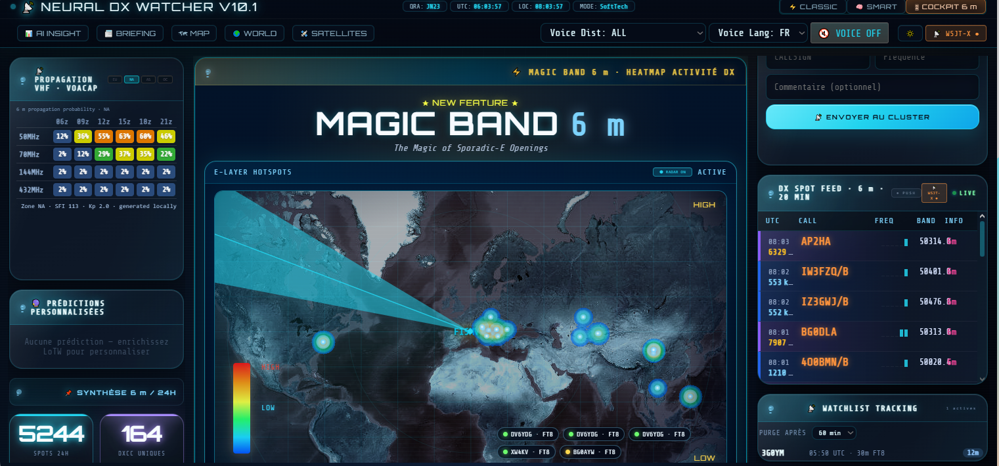

# 📡 Neural DX Watcher — v10.2

**DX Cluster Dashboard & Advanced Radio Analysis Engine**

Application web locale de surveillance DX et d'analyse radio destinée aux radioamateurs exigeants.  
Conçue pour **observer**, **comprendre** et **prendre du recul** — pas pour faire du bruit visuel.

---

## 🧭 Présentation générale

**Neural DX Watcher** est une application web locale qui :

- se connecte à un ou plusieurs **DX Clusters (Telnet)**
- affiche les **spots en temps réel** (HF / VHF / UHF)
- intègre les **indices solaires** (SFI, A, Kp…)
- conserve une **mémoire exploitable** de l'activité
- propose **plusieurs niveaux de lecture**, du live à l'analyse stratégique
- **prédit** les ouvertures probables selon ton activité et tes DXCC manquants

> L'objectif n'est pas de voir beaucoup,  
> mais de **voir juste**.

---

## 🖥️ Pages principales

### 1️⃣ Page **Index** — Temps réel & suivi opérateur

Page d'observation immédiate. Elle affiche :
- le flux de spots en direct
- les bandes actives
- les DX recherchés (*wanted*)
- les indices solaires
- les signaux de **surge** d'activité

👉 **Objectif : savoir ce qui se passe maintenant.**

---

### 📡 Pavé **WATCHLIST · Tracking**

> *« Je n'étais pas devant l'écran : qu'ai-je raté ? »*

- basé sur la watchlist
- exploite un historique en mémoire
- affiche les derniers spots par indicatif
- ✅ outil de rattrapage pensé pour l'opérateur humain

---

### 2️⃣ Page **Map** — Carte d'observation

Carte classique des spots individuels — chaque point = une station.  
👉 **Objectif : voir où ça se passe.** La page Map est un **outil d'exécution**.

---

### 3️⃣ Page **Analyse** — META ANALYSE différée

Outil volontairement non temps réel, basé sur l'analyse du log applicatif.  
👉 **Outil de recul**, pas un gadget.

---

### 4️⃣ Page **World** — Forecast & Anomalies

| Page | Nature | Question |
|---|---|---|
| Map | Observation brute | Qui est actif maintenant ? |
| World | Analyse interprétée | Où la propagation est anormalement favorable ? |

- affichage de **zones**, pas de stations
- clustering spatio-temporel, filtrage du bruit

👉 **World décide, Map exécute.**

---

### 5️⃣ Page **Briefing**

Se met à jour toutes les 12 heures, reprenant les infos DX essentielles. Possibilité d'ajouter automatiquement les calls dans la watchlist.

---

### 6️⃣ Page **Satellites**

Suivi temps réel des satellites amateurs (AO-91, RS-44, SO-50, ISS…). Calcul local via sgp4, prochains passages (AOS/TCA/LOS), fréquences uplink/downlink depuis SatNOGS.

---

📸 Aperçu



---

## 🚀 Installation

```bash
git clone https://github.com/F1SMV/Neural-DX-Watcher.git
cd Neural-DX-Watcher
chmod +x start.sh
./start.sh
```

L'application sera accessible sur `http://localhost:8000`

---

## ⚙️ Architecture technique

- Backend : Python / Flask
- Frontend : HTML / CSS / JavaScript
- Cluster : Telnet DX Cluster
- Analyse : scripts Python dédiés
- Stockage : mémoire + JSON locaux + **SQLite**

Aucune dépendance cloud.

---

## 🗂️ Historique des versions

### v10.2 — Migration TLE format JSON OMM (CelesTrak)

#### 🛰️ Compatibilité catalogues satellites post-juillet 2026

CelesTrak épuisera les numéros de catalogue à 5 chiffres (limite à 69999) autour du **12 juillet 2026**. À partir de cette date, les nouveaux satellites auront des numéros ≥ 100000 et ne seront plus disponibles au format TLE texte classique.

**Nouvelle architecture de chargement TLE — 3 couches :**

1. **Sources JSON OMM (priorité)** — CelesTrak GP API :
   - `gp.php?GROUP=amateur&FORMAT=json` → tous les satellites amateurs
   - `gp.php?GROUP=stations&FORMAT=json` → ISS, CSS Tiangong, etc.
   - Format OMM : `OBJECT_NAME`, `NORAD_CAT_ID` (entier natif, illimité), `TLE_LINE1`, `TLE_LINE2`
   - `TLE_LINE1`/`TLE_LINE2` passés directement à `sgp4.twoline2rv()` — aucun changement dans le reste du code

2. **Fallback texte (AMSAT nasa.all)** — complémente le JSON pour les satellites manquants, opérationnel jusqu'en juillet 2026

3. **Log consolidé** — au démarrage : nombre de satellites chargés par source (JSON vs texte)

**Aucun impact utilisateur** — le reste du code (calculs az/el, prédictions, popup fréquences) est inchangé.

---

### v10.1 — Mode COCKPIT redessiné · Radar sweep · Satellites améliorés · Corrections

#### 🎛 Refonte visuelle du mode COCKPIT

**Pavé PROPAGATION VHF · VOACAP**
- Format simplifié : tableau HTML 4 bandes (50 / 70 / 144 / 432 MHz) × 6 créneaux horaires
- Cellules colorées par pourcentage (rouge → orange → jaune → vert → bleu)

**Effet Radar Sweep** (🆕 bouton toggle ON/OFF)
- Faisceau animé par canvas `requestAnimationFrame`, centré sur le **QTH de l'opérateur**
- Cercles concentriques radar, trainée décroissante, point QTH lumineux
- Points pulsants synchronisés — projetés depuis les vraies coordonnées Leaflet
- Bouton `⬤ RADAR ON / ○ RADAR OFF` dans le header du pavé Magic Band
- État mémorisé en localStorage

**Légende d'échelle d'activité unifiée** (🆕)
- 6 niveaux : FERMÉ → FAIBLE → CORRECT → OUVERTURE → FORTE → HOT

**Watchlist Tracking cockpit** (🆕)
- Clone du pavé Watchlist disponible directement dans la colonne 3 du cockpit
- Affichage direct trié par dernier spot, sélecteur de purge configurable

**DX Spot Feed amélioré**
- Calls en **orange** (lisibilité renforcée), watchlist en jaune, new DXCC en rouge
- Distance en **priorité** dans la colonne INFO

**Scroll de page**
- La molette scrolle librement toute la page cockpit (plus de scroll interne par colonne)

**Jauge Opening Strength agrandie** — 132px → 200px

#### 🛰️ Page Satellites — Fréquences uplink/downlink

- Popup carte enrichi avec les **fréquences radio** de chaque satellite
- Source : API SatNOGS (`db.satnogs.org/api/transmitters/`), cache serveur 6h
- ↓ downlink en vert · ↑ uplink en orange · mode (FM / Linear / CW…)
- Fréquences stables — préservées à chaque rafraîchissement de position
- Nouvelle route backend : `GET /api/satellites/frequencies/<norad_id>`

**Correction type satellite**
- Les satellites amateurs apparaissaient comme « inconnu » dans le tableau Az/El
- Nouvelle fonction `_infer_sat_type()` : AO-, SO-, RS-, OSCAR, FUNCUBE, AMSAT → amateur ; NOAA, METOP → weather ; ISS, CSS → station
- Appliqué sur les deux endpoints : positions et catalogue

**Correction azimut** 🔴 *(bug sérieux)*
- L'azimut était systématiquement décalé de **180°** (RS-44 : 118° au lieu de 298°)
- Cause : `atan2(-e, s)` au lieu de `atan2(e, s)` dans la formule SEZ
- Tous les calculs (position courante, passages AOS/LOS) sont désormais corrects

---

### v10.0 — Moteur prédictif · Sparklines · Alertes push (optionnel)

#### 🔮 Moteur prédictif personnel (`predictor.py`)

**Collecte SQLite** (`data/predictor.sqlite`) : tables `spot_log`, `es_events`, `sessions`, `missing_dxcc`, purge auto 90 jours.

**Scoring probabiliste** : patterns Es saisonniers/horaires, boost directionnel, facteur bande, bonus historique, croisement DXCC manquants LoTW.

**Cockpit · Prédictions** : pavé TOP 5 fenêtres les plus probables sur 24h.  
Routes : `/api/predictions`, `/api/predictor/stats`, `POST /api/presence`

#### 📊 Sparklines dans le DX Feed

Canvas 40×14 px · 6 barres de 10 min · auto-injectés par MutationObserver

#### 🔔 Alertes push intelligentes (`ntfy.sh`, optionnel)

3 types : watchlist spotté / NEW DXCC / ouverture 6m · Anti-spam 15 min SQLite · filtre présence opérateur  
Routes : `/api/ntfy/status`, `POST /api/ntfy/test`

#### 🎨 Design système unifié

Glassmorphism, HUD scanlines, palette cyan appliquée à toute l'application.

---

### v9.5 — Géolocalisation fine · Heatmap gaussienne · Envoi direct

- 100+ districts précis (USA W0-W9, Canada VE1-7, Japon JA0-9, Russie UA0-9…)
- Heatmap gaussienne 6m style radar météo
- Click sur tableau → spot envoyé immédiatement

### v9.4 — Intégration WSJT-X + Clustering 6m

- Parser UDP Qt complet, locator Maidenhead → lat/lon précis
- Clustering géographique 400km, 5 niveaux de couleur

### v9.2 — Thème Cockpit unifié

### v9.0 — NEURAL DX & Mode COCKPIT 6 m

- Sélecteur 3 modes : ⚡ CLASSIC / 🧠 SMART / 🎛 COCKPIT 6 m
- Interface cockpit 3 colonnes, jauge Opening Strength, VOACAP

### v8.2 — LoTW persistance + Magic Band

### v8.1 — Mode Intelligent amélioré + World relooké

- Rareté : TRÈS RARE / RECHERCHÉ / TRACKING / EXOTIC DX
- World : plein écran, HUD flottant, greyline intégrée

### v8.0 — Mode Intelligent 🧠

Score composite : Nouveau DXCC (+40) · Watchlist (+30) · Bande manquante (+10) · SFI (+20) · SPD (+30) · 10k+km (+15)

### v7.7 — Responsive · v7.6 — Greyline · v7.5 — Purge Watchlist

### v7.2 — Satellite Tracker

Suivi temps réel, calcul local sgp4, prochains passages AOS/TCA/LOS

### v7.1 — Opportunités DXCC LoTW

Croisement automatique expéditions à venir (21 jours), page Briefing refaite

### v7.0 — Intégration LoTW & Bandmap

Connexion sécurisée, stats DXCC par bande, badges NEW/✓, bandmap zoom 100×

### v6.9 — VOACAP local · v6.5 — Brief vocal IA · v6.4 — Bandmap

### v6.0 — Release stable · v5.6 — World (expérimental) · v5.2 — META ANALYSE

---

## 👤 Auteur

Développé par **F1SMV – Eric**  
avec l'assistance de Claude (Anthropic)  
au service de la communauté radioamateur.  
Contact : @f1smv sur X
