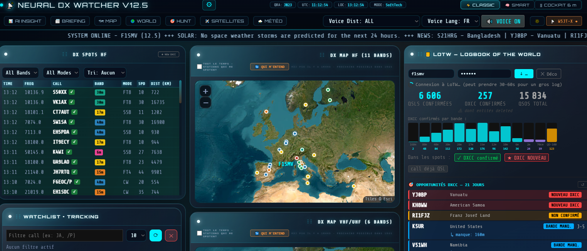

# ⚡ Neural DX Watcher — v11.3

**DX Cluster Dashboard & Advanced Radio Analysis Engine**

Application web locale de surveillance DX et d'analyse radio destinée aux radioamateurs exigeants.  
Conçue pour **observer**, **comprendre** et **prendre du recul** — pas pour faire du bruit visuel.

---

## 🧭 Présentation générale

**Neural DX Watcher** est une application web locale qui :

- se connecte à un ou plusieurs **DX Clusters (Telnet)**
- affiche les **spots en temps réel** (HF / VHF / UHF)
- intègre les **indices solaires** (SFI, A, Kp…)
- conserve une **mémoire exploitable** de l'activité
- propose **plusieurs niveaux de lecture**, du live à l'analyse stratégique
- **prédit** les ouvertures probables selon ton activité et tes DXCC manquants, avec une **fiabilité mesurée** (pas affichée arbitrairement)
- accessible via **HTTPS sécurisé** (reverse proxy + Let's Encrypt) pour un usage distant

> L'objectif n'est pas de voir beaucoup,  
> mais de **voir juste**.

---

## 🖥️ Pages principales

### 1️⃣ Page **Index** — Temps réel & suivi opérateur

Page d'observation immédiate. Elle affiche :
- le flux de spots en direct
- les bandes actives
- les DX recherchés (*wanted*)
- les indices solaires (SFI, A-index, K-index)
- les signaux de **surge** d'activité (HF, 6m et 2m)

👉 **Objectif : savoir ce qui se passe maintenant.**

---

### 📡 Pavé **WATCHLIST · Tracking**

Fonction introduite pour répondre à un besoin simple :
> *« Je n'étais pas devant l'écran : qu'ai-je raté ? »*

- basé sur la watchlist
- exploite un historique en mémoire
- affiche les derniers spots par indicatif

Philosophie :
- ❌ pas un log brut
- ❌ pas un dump massif
- ✅ un outil de rattrapage
- ✅ pensé pour l'opérateur humain

---

### 📶 Pavé **MY SIGNAL** — Self-monitoring PSK Reporter *(v10.5)*

> *« Qui m'entend, où, avec quel SNR ? »* — sans jamais quitter l'application.

- Source : API PSK Reporter, interrogée en JSONP
- Toutes bandes HF/VHF/UHF, tous modes digitaux (FT8/FT4/WSPR/JT65/JS8/MSK144)
- Indicatif receveur, mode, fréquence, distance, âge du rapport, SNR coloré
- **Affichage de fraîcheur** : "MàJ PSK il y a Xs · prochaine possible dans Ys" *(v11.3)*
- Intégré dans les **3 modes** (CLASSIC, SMART, COCKPIT)

👉 **Test d'antenne instantané, vérification avant de lancer un appel dans un pileup.**

---

### 2️⃣ Page **Map** — Carte d'observation (micro-lecture)

Carte classique des **spots individuels** :
- chaque point = **une station**
- représentation géographique immédiate
- vision instantanée
- **filtre par bande** : n'affiche que la bande sélectionnée *(v11.3)*
- mode **"QUI M'ENTEND"** : stations qui te reçoivent avec enveloppe grand cercle

👉 **Objectif : voir où ça se passe.** La page Map est un **outil d'exécution**.

---

### 3️⃣ Page **AI Insight** — Analyse & META ANALYSE différée *(anciennement "Analyse", renommée v10.2)*

Outil volontairement **non temps réel**, basé sur l'analyse du log applicatif. Accessible via `/ai-insight`.

👉 **Outil de recul**, pas un gadget.

---

### 4️⃣ Page **World** — Forecast & Anomalies

La page **World** est **fondamentalement différente** de la page Map.

| Page  | Nature              | Question                                       |
| ----- | ------------------- | ----------------------------------------------- |
| Map   | Observation brute   | Qui est actif maintenant ?                     |
| World | Analyse interprétée | Où la propagation est anormalement favorable ? |

- affichage de **zones**, pas de stations
- clustering spatio-temporel
- filtrage du bruit
- rafraîchissement contrôlé

👉 **World décide, Map exécute.**

---

### 5️⃣ Page **Briefing**

Se met à jour toutes les 12 heures, reprenant les infos DX essentielles. Possibilité d'ajouter automatiquement les calls dans la watchlist de la page Index. Vous ne raterez aucune expédition : dès qu'un call est spotté, il s'affiche en jaune dans le pavé DX spots.

---

### 6️⃣ Page **Satellites**

Suivi temps réel des satellites amateurs (AO-73, AO-91, AO-92, ISS, RS-44, SO-50, FO-29, PO-101…). Calcul local via **sgp4**, prochains passages (AOS/TCA/LOS), **fréquences uplink/downlink** depuis SatNOGS *(v10.1)*, type de satellite auto-détecté *(v10.1)*, calcul d'azimut corrigé *(v10.1)*, TLE au format JSON OMM compatible post-2026 *(v10.2)*, **clipping de latitude 70°N/S** sur enveloppe MY SIGNAL *(v11.3)*.

---

📸 Aperçu



---

## 🚀 Installation

```bash
git clone https://github.com/F1SMV/Neural-DX-Watcher.git
cd Neural-DX-Watcher
chmod +x start.sh
./start.sh
```

L'application sera accessible sur `http://localhost:8000`

> 💡 Un **Raspberry Pi** est recommandé pour la faible consommation électrique, mais le programme fonctionne sur n'importe quel PC sous Linux.

---

## 🔐 Installation HTTPS sécurisée (accès distant) — *v11.3*

### 1. Obtenir un domaine DDNS
Va sur [duckdns.org](https://www.duckdns.org), crée un sous-domaine gratuit, récupère ton token.

### 2. Installer acme.sh
```bash
curl https://get.acme.sh | sh -s email=ton@email.com
source ~/.bashrc
```

### 3. Générer un certificat Let's Encrypt (challenge DNS)
```bash
export DuckDNS_Token="TON_TOKEN"
~/.acme.sh/acme.sh --issue --dns dns_duckdns -d f1smv-dxwatcher.duckdns.org
```

### 4. Configurer nginx (reverse proxy)
```bash
sudo apt install nginx apache2-utils
sudo mkdir -p /etc/nginx/ssl
~/.acme.sh/acme.sh --install-cert -d f1smv-dxwatcher.duckdns.org \
  --key-file       /etc/nginx/ssl/dxwatcher.key \
  --fullchain-file /etc/nginx/ssl/dxwatcher.crt \
  --reloadcmd      "sudo systemctl reload nginx"

sudo htpasswd -c /etc/nginx/.htpasswd f1smv   # mot de passe
```

Créer `/etc/nginx/sites-available/neuraldx` avec la configuration reverse proxy sur le port **8443** (n'interfère pas avec ton NAS sur 443).

### 5. Routeur
Forward du port externe **8443** vers `192.168.1.81:8443` (TCP).

**Accès distant :** `https://f1smv-dxwatcher.duckdns.org:8443` — TLS valide, Basic Auth nginx + token API applicatif.

---

## ⚙️ Architecture technique

- Backend : Python / Flask
- Frontend : HTML / CSS / JavaScript
- Cluster : Telnet DX Cluster
- Analyse : scripts Python dédiés (`predictor.py`, `dxcc_resolver.py`)
- Stockage : mémoire + JSON locaux + **SQLite**
- Sécurité : token API local + reverse proxy nginx (v11.3)

Aucune dépendance cloud.

---

## 🗂️ Historique des versions

### v11.3 — Infrastructure HTTPS · K-index fixé · Filtrage cartes · Fraîcheur PSK Reporter

#### 🔐 Reverse proxy nginx + DuckDNS + Let's Encrypt (sécurité v11.3)

- Configuration complète reverse proxy sur port **8443** (sans conflits avec le 443 du NAS)
- Challenge DNS acme.sh : aucun port 80/443 requis
- Basic Auth nginx + token API applicatif (double couche)
- Flask reste local 127.0.0.1:8000 (inaccessible depuis Internet)
- Accès distant HTTPS sécurisé : `https://f1smv-dxwatcher.duckdns.org:8443`

#### 🗺️ Filtre bande sur cartes (v11.3)

Quand tu sélectionnes une bande dans le pavé **DX SPOTS HF/VHF**, la carte n'affiche **que cette bande** (pas toutes les bandes) → meilleure lisibilité en un coup d'œil.

#### 📶 Affichage fraîcheur MY SIGNAL (v11.3)

- Texte explicite : *"MàJ PSK il y a Xs · prochaine possible dans Ys"*
- Rend transparent le délai de 5 min qui semblait "figé"
- Affiché dans le panel MY SIGNAL et près des boutons "QUI M'ENTEND"

#### 🔮 K-index enfin visible (v11.3)

**Bug racine :** le parsing NOAA attendait `[ ["time_tag","Kp",...], [...], ... ]` (tableaux de tableaux), mais NOAA envoie `[ {"time_tag":"...","Kp":3.67,...}, ... ]` (objets dict). Résultat : Kp renvoyait `None` silencieusement, le K-index restait "N/A" indéfiniment.

**Fix complet :**
- Parsing NOAA accepte maintenant les deux formats (dict ET tableaux)
- Fallback A-index si Kp NOAA indisponible : Kp ≈ A/3
- Logging amélioré pour tracer les échecs de fetch

#### 📊 Cache PSK Reporter ajusté (v11.3)

- TTL : 90s → **300s** (5 min = limite officielle NOAA)
- 90s = 3.3× sur-sollicitation → throttling silencieux après quelques semaines
- Polling frontend : 90s → 20s (interroge le cache backend local, pas PSK Reporter directement)
- Récalcul dynamique de `age_s` : même en fallback, l'âge des rapports grandit correctement

#### 📍 Clipping latitude enveloppe MY SIGNAL (v11.3)

- Enveloppe grand cercle coupée à **70°N/S**
- Élimine l'effet "toile" au-dessus du Groenland en projection Mercator

#### 🎨 Corrections interface (v11.3)

- Label "Analyse" → "AI Insight" dans `briefing.html` (cohérence)
- Favicon ajouté à `briefing.html`
- Interception token API corrigée sur `briefing.html` (cassait les POST watchlist silencieusement)
- Setup ⚙ complet : 31 pavés listés à plat (labels FR), persistance backend partagée

---

### v11.2 — Corrections critiques : META ANALYSE, AI Insight, Satellites

#### 🐛 Erreur 500 sur META ANALYSE — script analyseur manquant

Le dossier `tools/` et le script `tools/log_meta_analyzer.py` n'existaient pas sur le serveur — la route `POST /api/meta/run` échouait systématiquement. Écriture complète du script manquant.

#### 🔧 Page AI Insight — `confirm()`/`alert()` natifs enfin remplacés

Les popups navigateur natifs (`confirm()`, `alert()`) étaient toujours présents en production. Corrigé : dialog HTML inline.

#### ⏳ Page Satellites — indicateur de chargement

Le premier appel de calcul de position (TLE + sgp4) peut prendre jusqu'à 45 secondes après un démarrage serveur. Ajout d'un indicateur de chargement explicite.

---

### v11.1 — Sécurité niveau 2

- Token API local (`X-API-Token`), généré dans `data/api_token.txt` (chmod 600)
- Intercepteur `fetch()` global côté frontend

### v11.0 — Refonte predictor.py, dxcc_resolver.py, durcissement sécurité

### v10.5 → v10.0 — [voir plus bas]

---

## 👤 Auteur

Développé par **F1SMV – Eric**  
avec l'assistance de Claude (Anthropic)  
au service de la communauté radioamateur.  
Contact : @f1smv sur X
